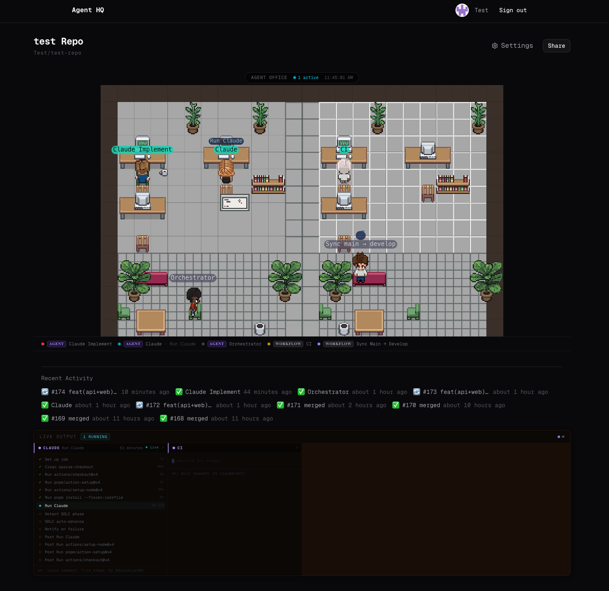
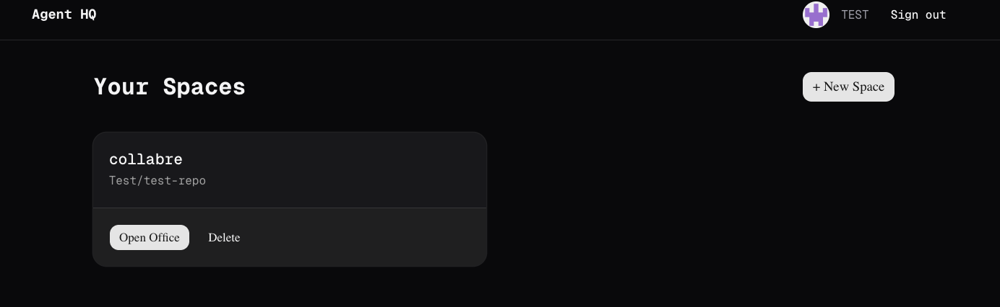
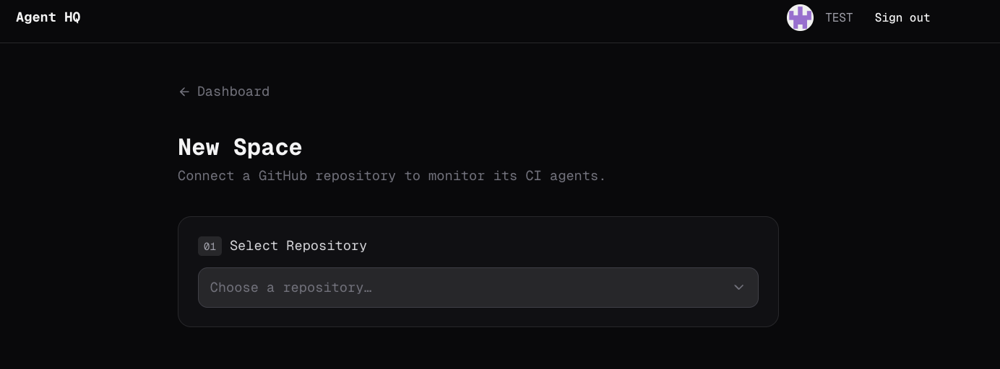

<p align="center">
  
</p>

<h1 align="center">Agent HQ</h1>

<p align="center">
  <strong>Watch your GitHub Actions CI agents work in real time — as animated pixel-art characters in a virtual office.</strong>
</p>

<p align="center">
  <a href="https://github.com/Adanielyan92/agent-hq/stargazers"></a>
  <a href="https://github.com/Adanielyan92/agent-hq/blob/main/LICENSE"></a>
  <a href="https://github.com/Adanielyan92/agent-hq/actions"></a>
  <a href="https://vercel.com/new/clone?repository-url=https://github.com/Adanielyan92/agent-hq&env=GITHUB_CLIENT_ID,GITHUB_CLIENT_SECRET,AUTH_SECRET,TOKEN_ENCRYPTION_SECRET&envDescription=See%20.env.example%20for%20setup%20instructions&project-name=agent-hq"></a>
</p>

---

## What is Agent HQ?

Agent HQ turns your GitHub Actions workflows into a live, animated pixel-art office. Each workflow — whether it's a Claude AI agent, a CI pipeline, or a deploy script — becomes a character with their own desk. When a workflow runs, its character walks to their desk and starts working. When idle, they hang out in the break room drinking coffee or sleeping.

**It works with any GitHub repo.** No configuration needed — just connect your repo and Agent HQ automatically detects and classifies every workflow.

### Why?

- **Visibility** — see at a glance which CI agents are active, idle, or failing across your repos
- **AI agent monitoring** — purpose-built for the emerging world of autonomous CI agents (Claude Code, GitHub Copilot, CodeRabbit) running alongside traditional CI
- **Team dashboards** — share a live office view with your team via a public link — no sign-in required
- **It's fun** — turns the boring GitHub Actions tab into something you actually want to look at

---

## Screenshots

<p align="center">
  
  <br /><em>Live office — agents at desks, idle ones in the lounge, activity feed and live logs below</em>
</p>

<table>
  <tr>
    <td align="center"><br /><em>Dashboard — manage your monitored repos</em></td>
    <td align="center"><br /><em>Connect a repo in seconds</em></td>
  </tr>
</table>

---

## Features

### Smart Workflow Detection

Agent HQ analyzes your workflow YAML files to automatically classify each one:

| Signal | How it's detected | Example |
|--------|-------------------|---------|
| **AI Actions** | Scans `uses:` steps for known AI actions | `anthropic/claude-code-action`, `github/copilot-*`, `coderabbitai/*` |
| **AI Secrets** | Detects AI-related environment variables | `ANTHROPIC_API_KEY`, `OPENAI_API_KEY` |
| **Keywords** | Matches names/filenames against known patterns | "claude", "copilot", "ci", "build", "deploy" |
| **Triggers** | Uses trigger types as a fallback signal | `schedule`, `issues` lean agent; `push`, `pull_request` lean workflow |

Workflows are classified as **Agent** (AI-powered, autonomous) or **Workflow** (traditional CI/CD). Users can override any classification from the settings page.

### Live Office Visualization

- Agents walk to their desks when a workflow starts and type at their computers
- Idle agents move to the break room — drinking coffee (1-3hrs idle) or sleeping (3hrs+)
- Name tags show the current step name and tool being used
- Live log output streams in a terminal panel below the office
- Activity feed shows recent runs, PRs, and issues

### Adaptive Layout

- 1-6 workflows: cozy 6-desk office
- 7-10 workflows: larger 10-desk layout
- 11+ workflows: extra agents hang in the lounge (still tracked in the status bar)

### User Overrides (Settings Page)

- Rename any workflow with a custom label
- Toggle between Agent and Workflow classification
- Hide workflows you don't care about
- Re-detect to pick up new/changed workflow files

### Shareable Links

Each space has a public share URL (`/s/[token]`) — anyone with the link can watch the live office without signing in. Enable/disable sharing with one click.

---

## Quick Start

### Option A: Deploy to Vercel (recommended)

1. Click the **Deploy with Vercel** button above
2. Create a [GitHub OAuth App](https://github.com/settings/developers) with callback URL `https://your-app.vercel.app/api/auth/callback/github`
3. Add Neon Postgres from the [Vercel Marketplace](https://vercel.com/marketplace)
4. Set the required environment variables (see below)
5. Run `pnpm db:push` to initialize the database schema

### Option B: Local development

```bash
git clone https://github.com/Adanielyan92/agent-hq.git
cd agent-hq
pnpm install
```

Create a [GitHub OAuth App](https://github.com/settings/developers) with callback URL `http://localhost:3000/api/auth/callback/github`, then:

```bash
cp .env.example .env.local
# Fill in your OAuth credentials and database URL
pnpm db:push    # initialize schema
pnpm dev        # http://localhost:3000
```

### Environment Variables

```bash
GITHUB_CLIENT_ID=...          # GitHub OAuth App
GITHUB_CLIENT_SECRET=...      # GitHub OAuth App
AUTH_SECRET=...                # openssl rand -base64 32
TOKEN_ENCRYPTION_SECRET=...   # openssl rand -base64 32
DATABASE_URL=...               # Neon Postgres connection string
AUTH_URL=https://your-app.vercel.app  # or http://localhost:3000
```

---

## How It Works

```
GitHub Actions API  ──>  /api/spaces/[id]/status  ──>  GameCanvas (Canvas 2D)
                          (polls every 10s)                  |
                         Neon Postgres                  OfficeState
                         (spaces, tokens)               (pathfinding, seats,
                                                         character animation)
```

1. **Connect** — Sign in with GitHub. Your access token is AES-256-GCM encrypted at rest.
2. **Detect** — Agent HQ scans `.github/workflows/` and classifies each workflow by analyzing actions, secrets, keywords, and triggers.
3. **Monitor** — The office view polls GitHub every 10 seconds for workflow runs, job steps, PRs, and issues.
4. **Animate** — The game engine maps each workflow's status to a character: active agents walk to desks; idle agents go to the lounge with coffee or zzz bubbles.

---

## Tech Stack

| Layer | Choice |
|-------|--------|
| Framework | [Next.js 16](https://nextjs.org) (App Router) |
| Auth | [Auth.js v5](https://authjs.dev) — GitHub OAuth |
| Database | [Neon Postgres](https://neon.tech) (serverless) |
| ORM | [Drizzle ORM](https://orm.drizzle.team) |
| UI | [Tailwind CSS v4](https://tailwindcss.com), [shadcn/ui](https://ui.shadcn.com), [Geist](https://vercel.com/font) |
| Game Engine | Custom Canvas 2D with A* pathfinding |
| Testing | [Vitest](https://vitest.dev) |
| Deployment | [Vercel](https://vercel.com) |

---

## Architecture

### Workflow Classifier (`lib/classify-workflows.ts`)

The classifier uses a weighted signal cascade — no hardcoded roles. Each workflow is scored independently:

```
Priority 1: Known AI actions (confidence 0.9)     anthropic/claude-code-action
Priority 2: AI secrets/env vars (confidence 0.7)   ANTHROPIC_API_KEY, OPENAI_API_KEY
Priority 3: AI keywords (confidence 0.6)            "claude", "copilot", "agent"
Priority 4: CI keywords (confidence 0.6)             "ci", "test", "build", "deploy"
Priority 5: Trigger heuristic (confidence 0.3)       schedule → agent, push → workflow
```

On ties, agent wins. All matching signals are recorded for transparency.

### Game Engine (`lib/game-engine/`)

```
game-engine/
├── types.ts              — CharacterState, Direction, tile constants
├── agentHqLayout.ts      — 24x16 office (6 desks)
├── agentHqLayoutLarge.ts — 30x18 office (10 desks)
├── tileMap.ts            — A* pathfinding, walkability checks
├── characters.ts         — per-frame state machine, animation
├── officeState.ts        — seat assignment, lounge dispatch, PC glow animation
├── assetLoader.ts        — sprite sheet and floor tile loading
└── renderer.ts           — Z-sorted scene rendering, name tags, tool/status bubbles
```

**Character states:** `TYPE` (at desk, working) → `WALK` (pathfinding) → `IDLE` (wandering) → `LOUNGE` (break room, with coffee/sleep indicators)

### Idle States

| Duration idle | Visual state | In-game behavior |
|--------------|-------------|------------------|
| < 1 hour | Idle | Sitting in lounge, normal |
| 1-3 hours | Coffee | Lounge with floating coffee emoji |
| 3+ hours | Sleeping | Lounge with floating zzz emoji |

---

## API Reference

| Route | Method | Auth | Description |
|-------|--------|------|-------------|
| `/api/repos` | GET | Session | List user's GitHub repos |
| `/api/detect` | POST | Session | Classify workflows for a repo |
| `/api/spaces` | POST | Session | Create a new space |
| `/api/spaces/[id]` | PATCH | Session | Update workflow config or share settings |
| `/api/spaces/[id]` | DELETE | Session | Delete a space |
| `/api/spaces/[id]/status` | GET | Session or share token | Live agent status + activity feed |
| `/api/spaces/[id]/share` | PATCH | Session | Toggle share link |

---

## Project Structure

```
agent-hq/
├── app/
│   ├── (auth)/page.tsx              — landing / sign-in
│   ├── dashboard/                   — space list + new space wizard
│   ├── spaces/[id]/page.tsx         — live office view
│   ├── spaces/[id]/settings/        — workflow settings page
│   ├── s/[share_token]/page.tsx     — public share view
│   └── api/                         — all API routes
├── components/
│   ├── office/                      — GameCanvas, OfficeFloor, LogFeed, AgentDesk
│   ├── spaces/                      — RepoPicker, WorkflowDetector, SpaceCard
│   └── ui/                          — shadcn/ui primitives
├── lib/
│   ├── game-engine/                 — canvas renderer + game loop
│   ├── classify-workflows.ts        — signal-based workflow classifier
│   ├── build-agent-status.ts        — GitHub API → AgentStatus[]
│   ├── workflow-colors.ts           — deterministic color hashing
│   ├── encrypt.ts                   — AES-256-GCM token encryption
│   ├── auth.ts                      — Auth.js config
│   └── db/                          — Drizzle client + schema
├── config/
│   └── office-layout.ts             — poll interval, grid config
├── public/
│   ├── sprites/                     — character sprite sheets (5 variants)
│   └── assets/                      — furniture, floor tiles, character PNGs
└── __tests__/                       — Vitest unit tests
```

---

## Contributing

Contributions are welcome! Here are some areas where help would be great:

### Good First Issues

- **More AI action patterns** — add detection for more AI tools (Devin, Sweep, etc.)
- **Sprite variants** — create new character sprite sheets for more visual variety
- **Furniture assets** — add more office furniture (plants, whiteboards, coffee machines)
- **Sound effects** — optional ambient office sounds and typing audio

### Bigger Projects

- **Custom themes** — let users choose different office themes (modern, retro, space station)
- **Webhook mode** — replace polling with GitHub webhooks for instant updates
- **Multi-repo spaces** — monitor multiple repos in one office
- **Mobile layout** — responsive design for smaller screens
- **Notification system** — alerts when agents fail or complete long-running tasks

### Development Workflow

```bash
pnpm install
pnpm dev          # start dev server
pnpm test         # run tests
pnpm test:watch   # watch mode
pnpm lint         # ESLint
pnpm db:push      # push schema changes
pnpm db:studio    # open Drizzle Studio
```

Tests use Vitest. The classifier and status builder have comprehensive test coverage — please add tests for new features.

---

## Inspiration & References

- [Pixel-art office games](https://store.steampowered.com/app/1708110/Idle_Startup_Tycoon/) — the visual style draws from top-down office management games
- [GitHub Actions API](https://docs.github.com/en/rest/actions) — workflow runs, jobs, and step-level detail
- [Claude Code Action](https://github.com/anthropic/claude-code-action) — the AI agent action that inspired this project
- [A* Pathfinding](https://en.wikipedia.org/wiki/A*_search_algorithm) — used for character movement in the game engine

---

## Security

- GitHub access tokens are **encrypted at rest** with AES-256-GCM using `TOKEN_ENCRYPTION_SECRET`
- Share tokens are random UUIDs — revoking sharing invalidates access immediately
- Auth.js JWT sessions are signed with `AUTH_SECRET`
- No raw tokens are ever written to the database or exposed to the client

---

## License

[MIT](LICENSE)

---

<p align="center">
  <sub>Built with pixels and caffeine by <a href="https://github.com/Adanielyan92">@Adanielyan92</a></sub>
</p>
